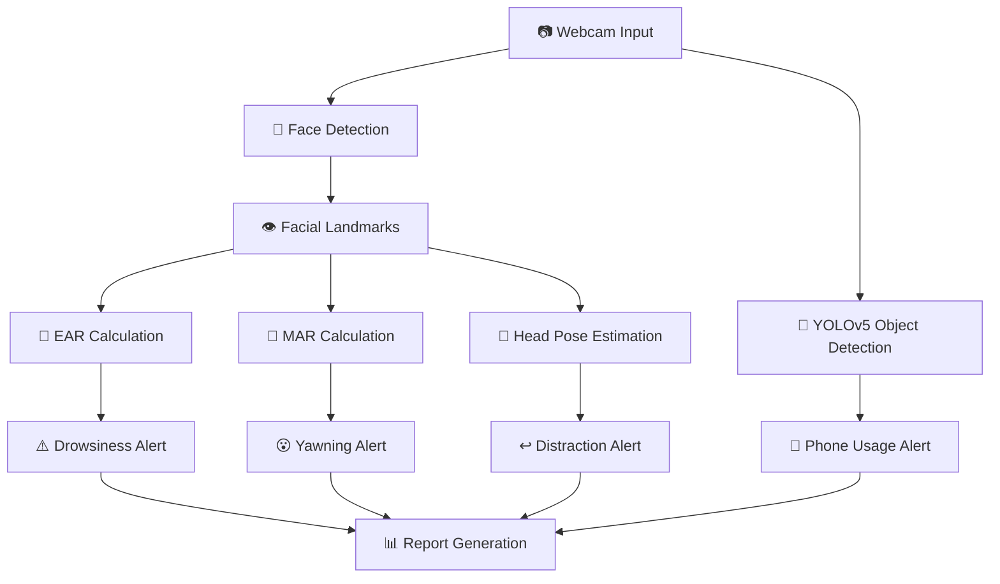

# Driver Drowsiness Detection System 🚗👁️💤


A real-time computer vision system to detect driver drowsiness and distractions using facial landmarks analysis and object detection.

## Features ✨

- 👀 **Eye Closure Detection** (EAR algorithm)
- 😴 **Drowsiness Detection** (prolonged eye closure >2s)
- 📱 **Phone Usage Detection** (YOLOv5)
- 🪑 **Head Pose Estimation**
- 😮 **Yawning Detection** (MAR algorithm)
- 🔊 **Audio Alerts** for dangerous behaviors
- 📊 **Session Logging & HTML Reports**

## Installation 🛠️

1. Clone the repository:
```bash
git clone https://github.com/URK21CS3005/Driver-Drowsiness-Detection-System.git
cd Driver-Drowsiness-Detection-System
```

2. Install dependencies:
```bash
pip install -r requirements.txt
```
3. Download the shape predictor file:

- shape_predictor_81_face_landmarks.dat

- Extract and place in project root

## Usage 🚀
```bash
python drowsiness_detection.py
```
## System Architecture 🏗️

## File Structure 📂
```
.
├── drowsiness_detection.py       # Main application
├── requirements.txt              # Dependencies
├── shape_predictor_81_face_landmarks.dat  # Landmark model
├── sounds/                       # Alert audio files
│   ├── regarder.mp3              # "Look ahead" alert
│   ├── reposer.mp3               # "Take rest" alert
│   ├── phone.mp3                 # "Phone detected" alert
│   └── welcomeengl.mp3           # Welcome message
├── report.html                   # Generated session report
└── README.md                     # This file
```
## Technical Details
1. Algorithms Used:
- Eye Aspect Ratio (EAR) for blink detection
- Mouth Aspect Ratio (MAR) for yawning detection
- Head Pose Estimation using solvePnP
- YOLOv5 for phone detection

2. Thresholds:
- EAR_THRESHOLD: 0.3 (auto-calibrates)
- MAR_THRESHOLD: 0.7
- DROWSY_DURATION: 2.0 seconds
